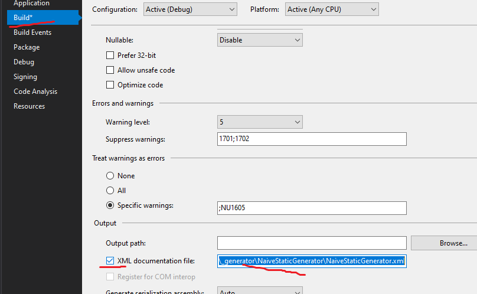

# Yadg.NET

Yet Another Documentation Generator for .NET. Unlike others, it parses the output folder of a given project. Also,
it's not a program, it's a library (but easily can be used as a program).

## How to use

Set the output file:




Now, here's an example of the code:

```cs
new WebsiteBuilder(
        new PageSaver(@"D:/destination_path")
    )
    {
        MainPageName = "Full documentation of my project",
        MainPageDescription = @"<p>
SomeDescription</p>
"
    }
    .Build(
        DocsParser.Parse(
            "D:/my_project/bin/Release/netstandard2.0/Project.xml"
        ).Build()
    );
```

It does NOT build a ready-to-use website. Once generated, write a script which
would add a header and a footer to this. Maybe at some point I will add default
footer and header, but is the point of doing so? 